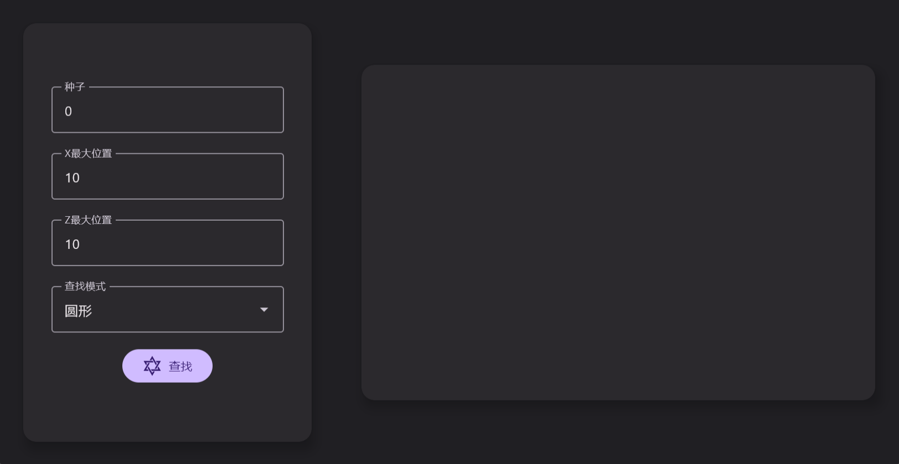

[English](https://github.com/starburst-xhl/slime-chunk-finder-for-xhl/blob/main/README.md) | **中文**
# 史莱姆区块助手

## 简介
这是我的“史莱姆空置域查找器”的自述文件，它使用了Jetpack Compose作为前端开发框架，可以帮助你找到史莱姆区块最多的可刷怪圆形区域（单人）。这是一个初级版本，功能有限，但我会不断改进和更新。

## 原理

这个程序的原理是按圆形匹配指定区域内的史莱姆区块，并找到史莱姆区块最多的圆形区域。这样你就可以在这个区域内建造你的史莱姆农场，收集大量的史莱姆球。我参考了Minecraft Wiki的源代码，感谢他们提供了史莱姆区块的生成算法。下图展示了匹配区域，黑色的方块表示将被匹配的区块，其他的区块将被忽略（当玩家位于中心时无法生成史莱姆）。

<div align=center></div>

## 使用方法

你需要一台Windows电脑，安装release中最新的msi文件，安装并运行它。
输入你的种子和搜索范围，它将会输出匹配到的有效区域的排名。注意，程序输出的是区域的中心区块的区块坐标(世界坐标需要乘16)。

```
Input Your Seed: 3425
Input Your xPosition: 1000
Input Your zPosition: 1000
-------------------Ranking of the regions-------------------
    ranking       xPosition       zPosition  total slime chunks
       1            -709            -474                  41
       2            -711            -474                  40
       3             682             -12                  39
       4            -711            -475                  38
       5            -711            -473                  38
       6            -710            -475                  38
...
```
<div align=center></div>

## 注意

这个程序无法排除深暗之域影响的区块，烦请自行检查。

搜索范围和返回的坐标均为区块坐标，请自行换算世界坐标（乘16就行，得到的坐标是该区块的西北角坐标）。

本程序仅适用于1.18及以上版本。

### 希望你喜欢这个程序，如果你有任何建议或反馈，请联系我。谢谢！
